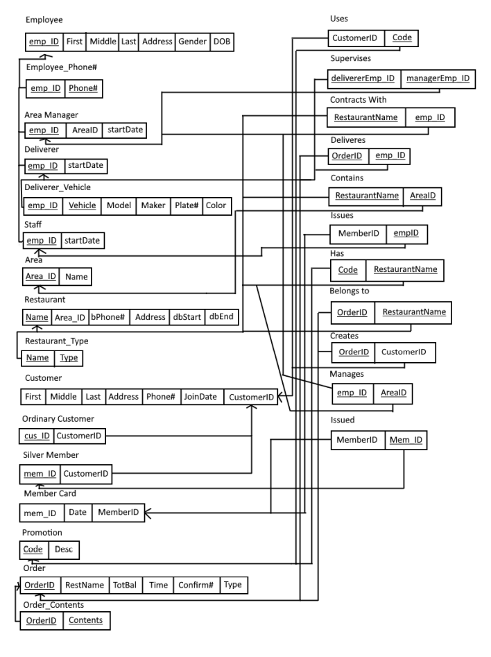

# Delivery Company Database

Delivery Company Database is an Oracle SQL developed database that utilizes 3rd Normal Form to ensure an optimal and clean data-managment system. It was developed for the intended use of a food delivery company, as it allows the user to store Employee info, restaurants, orders, transactions, and more through the use of 3NF table construction.

## 3NF EER Schema of Database

## Table Documentation

### Employee
Stores an employes name, ID, address, gender, dob, and ensures that no employee can be below the age of 18.
Primary Key = emp_ID. 

### Employee_Phone
Contains an employee's phone number, as an employee may have more than one, and storing more than one phone number would require duplication of an employee entry.
Primary Key = emp_ID, phone#.

### Area_Manager
Contains both an employee ID and an area_ID for the id that the area they manage. 
Primary Key = emp_ID.

### Deliverer
Contains both an employee ID and their start date as a deliverer.
Primary Key = emp_ID.

### Deliverer_Vehicle
Contains employee ID, vehicle name, model, maker, plate#, and color.
Primary Key = emp_ID.

### Staff
Contains both an employee ID and their start date as a staff member.
Primary Key = emp_ID.

### Area
Contains an area name and ID.
Primary Key = area_ID.

### Restaurant
Contains restaurant ID, area name, phone#, address, as well as a start and end datae for contract with the delivery company.
Primary Key = restaurant_name.

### Restaurant Type
Contains the name of a restaurant, along with the type of restaurant it is.
Primary Key = restaurant_name.

### Customer
Contains a customer ID, name, address, phonenumber, and join date.
Primary Key = customer_ID

### Ordinary_Customer
One of two types of customers. Contains an ordinary_ID and a customer ID.
Primary Key = ordinary_ID

### Silver_Member
The other variant of customer. Contains a silver member ID and a customer ID.
Primary Key = mem_ID. (silver member ID)

### Member_Card
Contains silver member ID along with a membership card ID. Also contains the date of becoming a silver member. 
Primary Key = member_ID. (membership card ID)

### Promotion
Contians promotional code and description of promotion.
Primary Key = code.

### Order
Contains order ID, restarurant name, order time, and confirm#.
Primary Key = order_ID.

### Order Contents
Contains the order ID and the contents of the order.
Primary Key = order_ID

### Uses
Relational Table between customer and promotion tables.
Primary Key = code.

### Supervises
Relational table between manager and deliverer.
Primary Key = delivererEmp_ID, managerEmp_ID.

### Contracts_With
Relational table between employee and restaurant.
Primary Key = emp_ID, restaurant_name.

### Deliveries
Relational table betwen order and employee.
Primary Key = emp_ID, order_ID.

### Contains
Relational table between area and restaurant. 
Primary Key = area_ID, restaurant_name.

### Issues
Relational table between customer card and staff member. Tracks who issued the membership card.
Primary Key = emp_ID

### Has
Relational table between promotion code and restaurant. 
Primary Key = code,restaurant_name.

### Belongs_To
Relational table between an order and the restaurant it belongs to.
Primary Key = order_ID,restaurant_name

### Creates
Relational table between customer and the order they created.
Primary Key = order_ID

### Manages
Relational table between area manager and the area they manage.
Primary Key = emp_ID, area_ID.

### Issued
Relational table between new silver member and their card ID
Primary Key = mem_ID (silver member ID)
